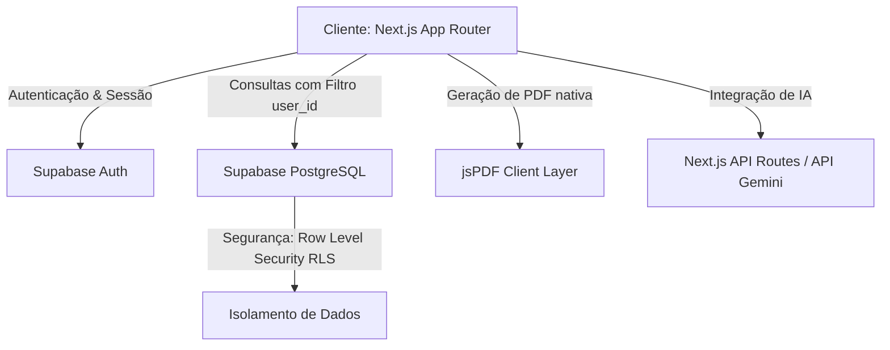

# EduTrack AI - Documentação Oficial do Sistema

Este documento descreve de forma abrangente a arquitetura de software, as especificações técnicas, as regras de segurança e as funcionalidades da plataforma **EduTrack AI**, uma solução inovadora projetada para elevar a produtividade acadêmica por meio de inteligência artificial e gamificação.

---

## 1. Visão Geral

O **EduTrack AI** é uma plataforma de gerenciamento acadêmico e mentoria inteligente desenvolvida sob medida para estudantes de tecnologia. O sistema visa combater a procrastinação, a sobrecarga de estudos e o burnout acadêmico por meio de três pilares:

1. **Estruturação Inteligente:** Organização visual de disciplinas e tarefas por meio de quadros Kanban interativos.
2. **Mentoria por Inteligência Artificial (IA):** Integração profunda com o modelo de linguagem Gemini AI para predição de estresse, quebra automática de tarefas complexas e feedbacks personalizados.
3. **Engajamento Gamificado:** Mecânica de RPG (Role-Playing Game) baseada em pontos de experiência (XP), níveis e heatmaps de atividade que transformam o progresso acadêmico em uma experiência interativa e motivadora.

O projeto é voltado para apresentações acadêmicas e profissionais (Innovation Lab / Trabalho de Conclusão de Curso), atendendo a rígidos critérios de arquitetura e conformidade legal com a LGPD. Foi construído integralmente sob a **Metodologia Open-Spec**, rejeitando práticas não estruturadas ("vibe coding") em favor de especificações declarativas que garantem uma base de código rastreável e à prova de falhas (*crash-proof*).

---

## 2. Arquitetura do Sistema

A arquitetura do **EduTrack AI** foi construída sobre princípios modernos de desenvolvimento web escalável, focando em desempenho máximo, carregamento rápido e interfaces dinâmicas com efeitos de glassmorphism em modo escuro estrito.



### 2.1. Frontend (Next.js - App Router)
- **Tecnologia:** Next.js (App Router), Pure JavaScript (sem TypeScript, conforme diretrizes do projeto).
- **Estilização:** Vanilla CSS combinado com Tailwind CSS para flexibilidade, estruturação responsiva e manutenção do design system.
- **Design System:** 
  - **Aparência:** *Strict Dark Mode* (Modo Escuro Estrito).
  - **Paleta de Cores:** Fundo principal em **Rich Black** (`#02040a`), acentos primários e botões em **Metallic Blue** (`#3a86ff`).
  - **Efeitos Visuais:** Efeito translúcido de *Glassmorphism* (`backdrop-blur-xl`, fundos `bg-white/5` ou `bg-black/60` com bordas sutis `border-white/5` ou `border-white/10`).
  - **Tipografia:** Uso de fontes modernas do Google Fonts (ex: Inter / Outfit).
  - **Animações (Anti-Crash UI):** Transições fluidas de entrada e interações de hover utilizando `framer-motion`. A Landing Page incorpora um *Particle Background* em **Vanilla JS Canvas**, entregando profundidade 3D (paralaxe) sem o peso de *pipelines* WebGL complexos, mantendo 60fps estáveis.
  - **Ícones:** Puramente baseados em vetores dinâmicos utilizando `lucide-react` para garantir a qualidade estética premium em todos os sistemas operacionais, banindo emojis nativos.
  - **Estabilidade de Estado:** Implementação de padrões rigorosos, como o uso de *guard flags* com `useRef` no Kanban para prevenir loops infinitos de re-renderização em `useEffect`, e limpeza da árvore de renderização (UI Otimista) ao retrair modais imediatamente após operações de exclusão.

### 2.2. Backend & Banco de Dados (Supabase + PostgreSQL)
- **Persistência de Dados:** Banco de dados relacional PostgreSQL hospedado de forma serveless no Supabase.
- **Estruturação:** Todas as tabelas e colunas utilizam estritamente o padrão `snake_case`.
- **Tabelas Principais:**
  - `user_profiles`: Armazena dados de progressive profiling obtidos no onboarding (nome, instituição, curso, turno, ocupação).
  - `subjects`: Gerencia as disciplinas criadas pelos estudantes (nome, professor, carga horária).
  - `academic_tasks`: Tarefas vinculadas diretamente às disciplinas (título, descrição, prazo, status, prioridade).
  - `study_sessions`: Registra sessões de foco/Pomodoro para alimentar métricas de horas de estudo.
  - `user_xp`: Controla o nível atual do usuário e os pontos de experiência acumulados.

---

## 3. Funcionalidades Principais

### 3.1. Gerenciamento e Kanban de Disciplinas
- **Quadro Kanban Interativo:** Organização de tarefas acadêmicas nas colunas de status ("A Fazer", "Em Progresso" e "Concluído").
- **Drag and Drop (DnD):** Transição de tarefas entre colunas de forma fluida.
- **Filtros Dinâmicos:** Filtro por disciplinas, datas de entrega e níveis de prioridade.
- **Modais de CRUD Rápidos:** Adição e edição instantânea de disciplinas e tarefas com estados de validação nativos no React.

### 3.2. Inteligência Artificial (AI Mentor & Insights)
O EduTrack AI utiliza o **Gemini AI** integrado a rotas de API seguras no backend, desenhadas com foco em altíssima resiliência:
- **Contrato REST Nativo:** Para evitar instabilidades de *build* causadas por SDKs pesados de IA, a comunicação com o Gemini é feita via `fetch` nativo do Node.js/Next.js, apontando diretamente para o endpoint oficial `gemini-3.5-flash`.
- **Smart AI Insights Panel (Consultoria IA):** Painel heurístico (estilo Terminal) que analisa dados dinâmicos globais (XP e Backlog de tarefas) enviando-os ao modelo para obter diagnósticos táticos sobre a carga cognitiva do estudante.
- **Quebrador Inteligente de Tarefas (AI Task Breaker):** Divide tarefas acadêmicas complexas em subetapas menores e gerenciáveis com prazos sugeridos pelo modelo.
- **Predição e Fallback Silencioso:** Caso a API de IA fique indisponível (ex: falhas de rede), as rotas possuem tratamento rigoroso (`try/catch`) que retorna um estado visual de *fallback* elegante (ex: "SISTEMA OFFLINE"), garantindo que a aplicação nunca quebre no frontend.

### 3.3. Gamificação Avançada e Produtividade RPG
- **XP HUD & Header:** Exibição do progresso de experiência (XP) no cabeçalho do dashboard com uma barra de progresso neon brilhante de cor azul metálico. O nível é calculado pela fórmula dinâmica: `Nível = floor(TarefasConcluídas / 5) + 1`.
- **Subida de Nível (Level Up):** Conclusão de tarefas de alta prioridade e sessões de estudo geram recompensas em XP e subidas de nível imediatas.
- **Heatmap de Atividade:** Gráfico de mapa de calor estilo GitHub integrado que destaca visualmente a consistência do estudante nos últimos meses de estudo, computando as demandas concluídas a cada dia.
- **Radar de Sobrecarga:** Gráficos interativos em formato radar (utilizando `recharts`) que medem as disciplinas com maior acúmulo de prazos.
- **Caderno Copiloto (Notebook):** Um ambiente rico de anotações em Markdown integrado com IA para reestruturar ideias, gerar resumos e criar cartões de estudo (flashcards).
- **Insígnias de Conquista (Badges):** Medalhas de alta fidelidade visual renderizadas no cabeçalho do dashboard ao lado da barra de nível:
  - **⚡ Foco Rápido (Zap):** Concedida a estudantes que utilizam ativamente ferramentas inteligentes (AI Insights/Copiloto) para acelerar seus planejamentos acadêmicos.
  - **🎯 Sniper de Prazos (Target):** Concedida pela conclusão de demandas acadêmicas com pelo menos 48 horas de antecedência em relação ao prazo final estipulado.
  - **🛡️ Zero Atrasos (ShieldCheck):** Concedida por manter o painel limpo, sem deixar nenhuma tarefa pendente ultrapassar a data limite de vencimento durante a semana corrente.
  - **Aura Premium Dinâmica:** Alunos assinantes do plano Pro contam com uma aura brilhante em neon de alta definição ao redor das insígnias sob foco do mouse (efeito de hover com escala `hover:scale-110` e tooltips customizados).

---

## 4. Regras de Monetização e Limitações

Para garantir a viabilidade comercial do projeto, a plataforma implementa travas sutis e regras de negócio inteligentes que diferenciam os planos e incentivam a conversão sem prejudicar a usabilidade:

| Funcionalidade | Plano Padrão (Gratuito) | Plano EduTrack Pro |
| :--- | :--- | :--- |
| **Preço** | R$ 0 / sempre | **R$ 9,90 / mês** |
| **Limite de Disciplinas** | Máximo de 3 matérias simultâneas | **Ilimitado** |
| **Limite de Tarefas** | Máximo de 20 tarefas criadas no mês | **Ilimitado** |
| **Mentoria e Insights de IA** | Limitação diária (5 requisições/dia) | **Ilimitada (Prioridade de Processamento)** |
| **Auras de Nível** | Tiers Básicos (Bronze, Prata, Ouro) | **Tiers Exclusivos (Platina e Diamante)** |
| **Exportação de PDF** | Incluído | **Incluído** |

- **Travas no Dashboard:** Ao tentar adicionar uma quarta disciplina no Plano Gratuito, o botão de submissão do modal é desativado e alterado para *"Limite de 3 atingido - Faça Upgrade"*, exibindo um link direto para a página premium. Da mesma forma, ao atingir o limite de 20 tarefas no mês, o formulário de tarefas renderiza um banner metálico de aviso bloqueando novas inserções e convidando ao upgrade.

---

## 5. Segurança, LGPD e Conectividade

A segurança e a proteção de dados pessoais são pilares centrais do **EduTrack AI**, garantindo privacidade, isolamento de dados e conformidade com a legislação brasileira (LGPD).

### 5.1. Row Level Security (RLS)
- **Princípio:** Todas as tabelas do banco de dados PostgreSQL possuem políticas ativas de RLS.
- **Regra:** Todas as consultas, inserções, atualizações e deleções filtram obrigatoriamente os dados com base no `user_id` autenticado do usuário ativo (`auth.uid()`).
- **Garantia:** Isso impede que qualquer usuário visualize ou manipule informações de outros estudantes, garantindo o isolamento absoluto de dados no nível do banco de dados.

### 5.2. Limitador de Taxa de API (API Rate Limiter)
- **Implementação:** Inclusão de um algoritmo de limitação na memória do servidor para proteger as rotas críticas de Inteligência Artificial (`/api/gemini-insights`).
- **Comportamento:** Ao atingir o limite diário no Plano Gratuito, o sistema retorna um status `429 Too Many Requests` com uma mensagem amigável sugerindo o upgrade para o plano Pro (*"Limite diário atingido no plano Padrão. Faça o upgrade para o Pro (R$ 9,90) e desbloqueie a IA ilimitada!"*).

### 5.3. Segurança e Privacidade no Onboarding (Progressive Profiling)
- **Coleta Consentida:** O modal de onboarding inicial explica de forma clara ao estudante o propósito da coleta de dados básicos (Curso, Instituição, Turno de Estudos e Ocupação).
- **Uso Estrito:** Esses dados são armazenados de forma criptografada no Supabase e utilizados apenas para refinar a inteligência dos conselhos e previsões do Mentor de IA.

### 5.4. LGPD & Páginas Legais
A plataforma possui páginas institucionais dedicadas para conformidade legal:
- **Banner de Cookies:** Consentimento explícito e de fácil aceitação/recusa no primeiro acesso.
- **Termos de Uso e Política de Privacidade:** Documentos detalhando a finalidade de cada dado coletado e as políticas de exclusão definitiva sob demanda (*Direito ao Esquecimento*).

### 5.5. Hardening de Infraestrutura e Anti-Scraping
- **Headers de Segurança HTTP:** Configuração de cabeçalhos de segurança estritos (como `Content-Security-Policy`, `X-Content-Type-Options`, `X-Frame-Options` e `Strict-Transport-Security`) para evitar ataques de injeção de scripts (XSS) e sequestro de cliques (Clickjacking).
- **Proteção Anti-Scraping:** Bloqueio ativo de user-agents suspeitos e de robôs de automação por meio do `middleware.js` do Next.js, mantendo a integridade dos dados e mitigando vazamentos por varreduras automáticas de terceiros.
- **Geração de PDF Segura:** Relatórios acadêmicos gerados nativamente no navegador utilizando a biblioteca **jsPDF** para evitar o envio de dados pessoais dos alunos para serviços terceiros de renderização em nuvem.

---

## 6. Como Executar o Projeto Localmente

### Pré-requisitos
- Node.js (v18 ou superior)
- Conta no Supabase com variáveis de ambiente configuradas

### Instalação e Execução
1. Clone o repositório.
2. Instale as dependências:
   ```bash
   npm install
   ```
3. Configure as variáveis de ambiente em um arquivo `.env.local` na raiz:
   ```env
   NEXT_PUBLIC_SUPABASE_URL=seu_supabase_url
   NEXT_PUBLIC_SUPABASE_ANON_KEY=seu_supabase_anon_key
   GEMINI_API_KEY=sua_gemini_api_key
   ```
4. Execute o servidor de desenvolvimento:
   ```bash
   npm run dev
   ```
5. Acesse `http://localhost:3000` no seu navegador.
