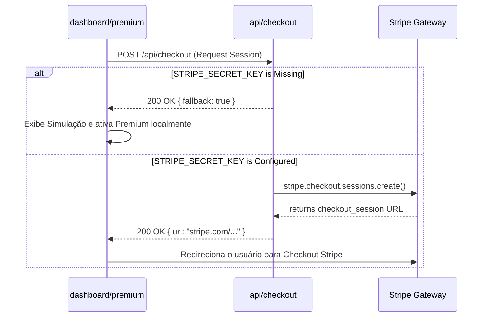

# Design: Checkout Stripe e Página de Preços Premium (Monetização)

## Componente: Página de Preços Premium (`app/dashboard/premium/page.jsx`)
- Estilização em **Strict Dark Mode** utilizando cores e efeitos da identidade visual do EduTrack (Rich Black `#030408` e Metallic Blue `#3a86ff`).
- Layout responsivo contendo dois cards com efeito de **Glassmorphism**:
  - **Plano Gratuito:** R$ 0. Detalha o uso básico do sistema.
  - **EduTrack Pro:** R$ 19,90/mês. Botão proeminente "Fazer Upgrade Agora".
- Benefícios destacados do plano Pro:
  - "IA Sem Limites" (Mentor e Copiloto avançados)
  - "Prioridade no Suporte"
  - "Tiers Exclusivos no Mapa de Calor" (Heatmap customizado de XP)
- Comportamento de Fallback: Se a rota de API retornar que as chaves não estão configuradas (ou a rota falhar), o sistema exibirá um modal de simulação amigável contendo um aviso de desenvolvimento, evitando interrupções na navegação do usuário.

---

## Componente: API Rota de Checkout (`app/api/checkout/route.js`)
- Rota executada via método `POST`.
- Se `process.env.STRIPE_SECRET_KEY` não for informada, a rota responderá com um JSON especial `{ fallback: true }`, ou erro controlado, permitindo ao frontend simular a assinatura localmente.
- Configuração do Checkout Session:
  - `payment_method_types: ['card']`
  - `mode: 'subscription'`
  - `line_items: [{ price: 'price_12345', quantity: 1 }]` (id de preço dummy do Stripe)
  - URLs de retorno:
    - Sucesso: `${origin}/dashboard?success=true`
    - Cancelamento: `${origin}/dashboard/premium`

---

## Estrutura do Fluxo de Caixa / Pagamento

